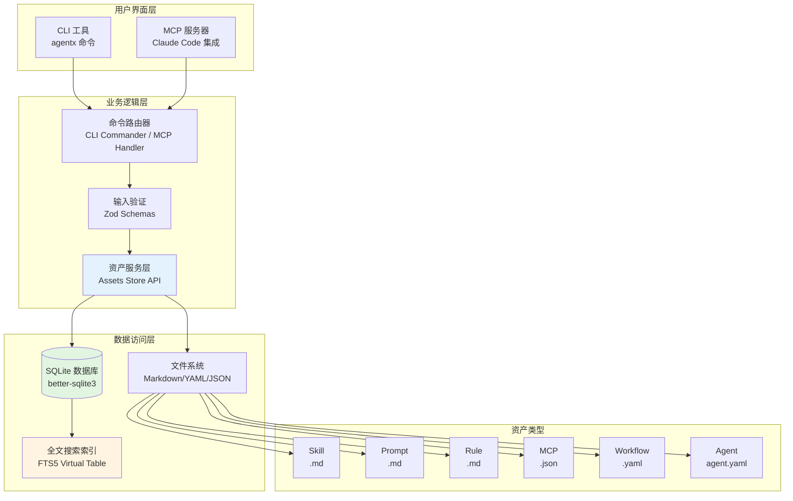
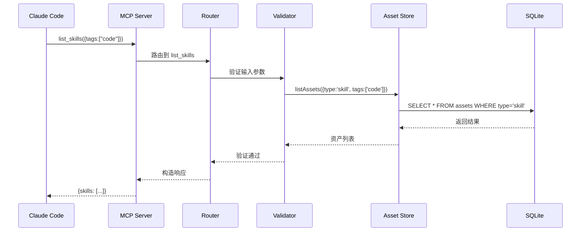
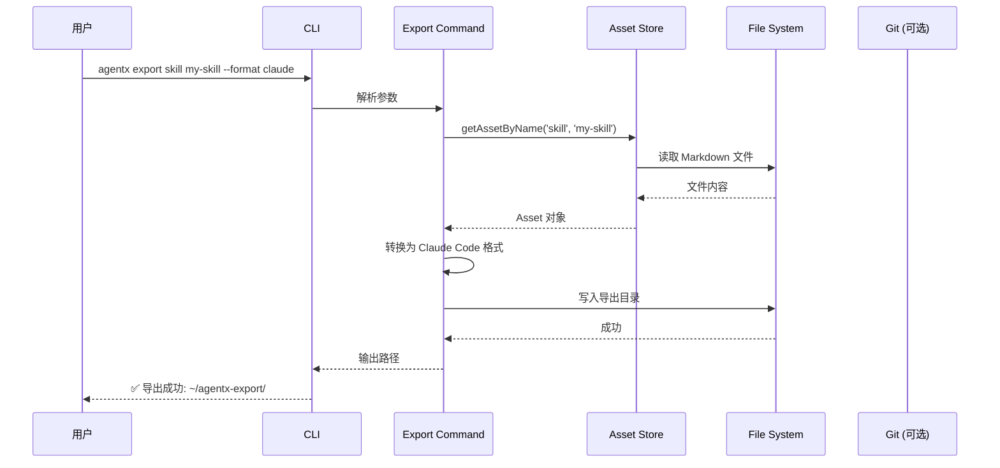

# 架构设计文档

**版本**: 1.0.0  
**最后更新**: 2026-04-29  
**适用对象**: 开发者、贡献者、系统架构师

---

## 📋 目录

1. [系统概述](#系统概述)
2. [架构原则](#架构原则)
3. [系统架构图](#系统架构图)
4. [核心模块](#核心模块)
5. [数据流](#数据流)
6. [存储设计](#存储设计)
7. [扩展点](#扩展点)
8. [技术选型](#技术选型)
9. [部署模式](#部署模式)
10. [性能与安全](#性能与安全)

---

## 系统概述

**AgentX** 是一个**本地优先的智能体资产管理器**，采用 **MCP（Model Context Protocol）** 标准，为 Claude Code 等 AI 助手提供技能、提示词、规则、MCP 配置、工作流和智能体的集中管理能力。

### 核心价值

| 特性 | 说明 |
|------|------|
| **本地优先** | 所有资产存储在本地 `~/.agentx/`，完全离线可用 |
| **Git 友好** | 资产以独立文件存储，便于版本控制和协作 |
| **模块化** | 6 种资产类型可独立管理、复用和组合 |
| **双入口** | 同时提供 MCP 服务器（Claude Code 集成）和 CLI 工具（命令行管理） |
| **全文本搜索** | 基于 SQLite FTS5 的快速全文检索 |

### 应用场景

- **代码助手**: 管理代码生成、审查、重构的 Prompt 模板
- **技术写作**: 标准化文档风格指南（Rule）+ 内容模板（Prompt）
- **数据分析**: 封装分析流程（Workflow）+ 专用工具配置（MCP）
- **团队协作**: 共享技能库、统一工作流规范

---

## 架构原则

### 1. 单一职责原则

每个模块只做一件事：
- `db.ts`: 仅负责数据库初始化和连接
- `assets.ts`: 仅负责资产的 CRUD
- `skills.ts`: 仅负责 Skill 工具的 MCP 注册

### 2. 依赖倒置

高层模块（MCP 服务器）不依赖低层模块（SQLite），而是依赖抽象（`AssetStore` 接口）。

```typescript
// 高层模块
import { AssetStore } from './store/assets.js';

// 低层模块实现接口
export const assetStore: AssetStore = {
  getAsset,
  listAssets,
  // ...
};
```

### 3. 数据本地化

所有用户数据存储在可配置的本地目录（默认 `~/.agentx/`），不依赖云服务。

### 4. 向后兼容

API 变更遵循语义化版本控制（SemVer），重大变更需在 CHANGELOG 中记录。

---

## 系统架构图



### 架构层次说明

| 层级 | 职责 | 技术实现 |
|------|------|---------|
| **用户界面层** | 提供两种入口方式 | CLI（commander）、MCP（SDK） |
| **业务逻辑层** | 路由、验证、业务规则 | Zod schema、命令注册表 |
| **数据访问层** | 数据库操作、文件读写 | better-sqlite3、fs/promises |
| **存储层** | 持久化数据 | SQLite + 文件系统 |

---

## 核心模块

### 1. 入口模块

#### `src/index.ts` - MCP 服务器

**职责**：
- 初始化 MCP 服务器
- 注册所有工具（Tool）到服务器
- 处理工具调用请求

**关键代码**：
```typescript
const server = new Server(
  { name: 'agentx', version: '1.0.0' },
  { capabilities: { tools: {} } }
);

server.setRequestHandler(ListToolsRequestSchema, async () => ({
  tools: Object.values(allTools).map(tool => ({
    name: tool.name,
    description: tool.description,
    inputSchema: tool.inputSchema
  }))
}));

server.setRequestHandler(CallToolRequestSchema, async (request) => {
  const { name, arguments: args } = request.params;
  const handler = allTools[name];
  if (!handler) throw new Error(`Unknown tool: ${name}`);
  return await handler.handler(args);
});
```

#### `src/cli.ts` - CLI 工具

**职责**：
- 定义命令行接口
- 注册子命令（list、search、get、delete、export、import）
- 解析参数并调用业务逻辑

**命令结构**：
```
agentx
├── list-skills [--type <type>] [--tags <tags>]
├── search <query> [--type <type>]
├── get <type> <name>
├── delete <type> <name>
├── export <type> <name> [--format claude|zip] [--output <path>]
└── import <path> [--merge]
```

### 2. 存储层

#### `src/store/db.ts` - 数据库初始化

**核心表结构**：

```sql
-- 主表：assets
CREATE TABLE assets (
  id TEXT PRIMARY KEY,           -- UUID
  type TEXT NOT NULL,            -- asset type
  name TEXT NOT NULL UNIQUE,     -- asset name
  description TEXT,              -- optional description
  tags TEXT DEFAULT '[]',        -- JSON array
  file_path TEXT NOT NULL,       -- absolute path
  created_at INTEGER NOT NULL,   -- timestamp
  updated_at INTEGER NOT NULL    -- timestamp
);

-- 索引
CREATE INDEX idx_assets_type ON assets(type);
CREATE INDEX idx_assets_name ON assets(name);

-- 全文搜索（FTS5）
CREATE VIRTUAL TABLE assets_fts USING fts5(
  id UNINDEXED,      -- 不索引 ID
  name,              -- 索引名称
  description,       -- 索引描述
  content,           -- 索引文件内容（通过触发器同步）
  tokenize = 'unicode61'
);

-- 触发器：保持 FTS 与主表同步
CREATE TRIGGER assets_fts_insert AFTER INSERT ON assets BEGIN
  INSERT INTO assets_fts(id, name, description)
  VALUES (new.id, new.name, COALESCE(new.description, ''));
END;
```

**设计决策**：
- **为什么用 SQLite？** 轻量、零配置、事务支持、FTS5 全文搜索
- **为什么分离文件存储？** 资产内容以 Markdown/YAML 格式独立文件，便于 Git 管理和人工编辑
- **FTS5 虚拟表**: 提供高效的全文检索，通过触发器自动同步

#### `src/store/assets.ts` - 资产核心操作

**主要函数**：

| 函数 | 功能 | 返回值 |
|------|------|--------|
| `createAsset(meta, content)` | 创建新资产 | `AssetMeta` |
| `getAsset(id)` | 根据 ID 获取资产 | `Asset` |
| `getAssetByName(type, name)` | 根据类型和名称获取 | `Asset` |
| `listAssets(filters)` | 列出资产（支持过滤） | `AssetMeta[]` |
| `updateAsset(id, updates)` | 更新资产元数据 | `AssetMeta` |
| `updateAssetContent(id, content)` | 更新资产内容 | `void` |
| `deleteAsset(id)` | 删除资产 | `void` |
| `searchAssets(query)` | 全文搜索 | `SearchResult[]` |

**重要约束**：
- 资产名称在同一类型内必须唯一
- 删除资产时同时删除关联文件
- 所有数据库操作在事务中执行

### 3. 工具注册层

**模式**：每个资产类型对应一个工具注册模块，导出一个注册函数：

```typescript
// src/tools/skills.ts
export function registerSkillTools(baseDir: string) {
  return {
    list_skills: {
      description: 'List all skills',
      inputSchema: { /* ... */ },
      handler: async (input) => {
        const assets = listAssets({ type: 'skill', tags: input.tags });
        return { skills: assets };
      }
    },
    get_skill: { /* ... */ },
    create_skill: { /* ... */ },
    // ...
  };
}
```

**注册流程**：
1. `index.ts` 调用 `registerSkillTools(baseDir)`
2. 返回工具对象（`Record<string, Tool>`）
3. 合并到 `allTools` 集合
4. MCP 服务器自动暴露这些工具

### 4. CLI 命令层

**命令注册模式**：

```typescript
// src/cli/commands/list.ts
export function registerListCommand(program: Command) {
  program
    .command('list-skills')
    .description('List all skills')
    .option('-t, --tags <tags...>', 'Filter by tags')
    .action(async (options) => {
      const assets = listAssets({ type: 'skill', tags: options.tags });
      console.table(assets);
    });
}
```

**命令分类**：
- **查询类**: `list-*`, `search`, `get`, `info`
- **修改类**: `delete`
- **导入/导出**: `export`, `import`

---

## 数据流

### 场景 1: MCP 客户端调用工具（Claude Code）



**关键路径**：
1. MCP 客户端发送 `CallTool` 请求
2. 服务器查找工具处理器
3. 输入验证（Zod schema）
4. 调用资产服务层
5. 数据库查询
6. 结果格式化并返回

### 场景 2: CLI 导出资产



**导出格式**：
- **Claude Code 格式**: 单个 JSON 文件，包含所有资产
- **ZIP 归档**: 压缩包，包含所有资产文件

---

## 存储设计

### 数据库 Schema

```sql
-- 资产主表
assets {
  id         TEXT PRIMARY KEY    -- UUID v4
  type       TEXT NOT NULL       -- 'skill' | 'prompt' | ...
  name       TEXT NOT NULL UNIQUE -- 人类可读名称
  description TEXT               -- 简短描述（可选）
  tags       TEXT DEFAULT '[]'   -- JSON 数组: ["tag1","tag2"]
  file_path  TEXT NOT NULL       -- 绝对路径: /path/to/file.md
  created_at INTEGER NOT NULL    -- Unix 时间戳（毫秒）
  updated_at INTEGER NOT NULL    -- Unix 时间戳（毫秒）
}

-- 索引
idx_assets_type   -- 加速按类型查询
idx_assets_name   -- 加速名称查找（唯一约束）

-- 全文搜索虚拟表
assets_fts {
  id        INTEGER UNINDEXED  -- 引用 assets.id
  name      TEXT               -- 可搜索
  description TEXT             -- 可搜索
  content   TEXT               -- 通过触发器从文件内容填充
}

-- 触发器（自动维护 FTS）
assets_fts_insert  -- INSERT 时同步
assets_fts_update  -- UPDATE 时同步
assets_fts_delete  -- DELETE 时同步
```

### 文件系统布局

```
~/.agentx/                    # AGENTX_DIR 环境变量可覆盖
├── skills/                   # Skill 资产
│   ├── code-review.md        # name = "code-review"
│   └── debugging.md
├── prompts/                  # Prompt 资产
│   ├── commit-message.md
│   └── pr-description.md
├── rules/                    # Rule 资产
│   └── typescript-style.md
├── mcps/                     # MCP 配置
│   └── filesystem.json
├── workflows/                # Workflow 定义
│   └── daily-standup.yaml
├── agents/                   # Agent 配置
│   └── junior-dev.yaml
└── agentx.db                 # SQLite 数据库
```

**文件命名规则**：
- 文件名 = `kebab-case` 的资产名称
- Skill/Prompt/Rule: `.md` 扩展
- MCP: `.json` 扩展
- Workflow: `.yaml` 扩展
- Agent: `agent.yaml` 固定名称（在 agents/ 目录下）

**文件内容格式**：
- **Skill/Prompt/Rule**: Markdown 格式，Frontmatter 包含元数据
  ```markdown
  ---
  name: code-review
  description: Review code for best practices
  tags: [code, quality]
  ---

  # Code Review Assistant

  You are a senior engineer reviewing code...
  ```
- **MCP**: JSON 格式（符合 MCP 规范）
- **Workflow**: YAML 格式（定义步骤和依赖）
- **Agent**: YAML 格式（包含 skills、prompts、rules 引用）

### 存储一致性保证

**原子性**：
- 创建资产时：先写文件 → 再插入数据库（事务内）
- 删除资产时：先删数据库 → 再删文件（事务内）
- 任何一步失败都会回滚

**触发器同步**：
- FTS 触发器保证搜索索引与主表一致
- 无需应用层额外代码

---

## 扩展点

### 1. 新增资产类型

**步骤**：
1. 在 `src/types/index.ts` 添加 `AssetType` 枚举值
2. 创建 `src/tools/<newtype>.ts` 实现 5 个 CRUD 工具
3. 在 `src/index.ts` 注册工具
4. 在 `src/cli.ts` 添加对应命令
5. 创建目录（如 `~/.agentx/<newtype>/`）
6. 更新文档

**示例**: 添加 `template` 类型
```typescript
// types/index.ts
export type AssetType = ... | 'template';

// tools/templates.ts
export function registerTemplateTools(baseDir: string) {
  return {
    list_templates: { /* ... */ },
    get_template: { /* ... */ },
    create_template: { /* ... */ },
    update_template: { /* ... */ },
    delete_template: { /* ... */ }
  };
}
```

### 2. 自定义工具处理器

可以注册自定义 MCP 工具（不绑定资产类型）：

```typescript
// src/tools/custom.ts
export function registerCustomTools() {
  return {
    my_custom_tool: {
      description: 'My custom tool',
      inputSchema: { /* ... */ },
      handler: async (input) => {
        // 自定义逻辑
        return { result: '...' };
      }
    }
  };
}
```

### 3. 插件系统（未来）

规划中的插件机制：
- 插件目录：`~/.agentx/plugins/`
- 插件格式：NPM 包或本地目录
- 钩子：`onAssetCreated`, `onAssetDeleted`, `onSearch`
- 示例插件：自动备份到云存储、资产同步、标签建议

---

## 技术选型

### 为什么选择这些技术？

| 技术 | 选择理由 | 替代方案 |
|------|---------|---------|
| **TypeScript** | 类型安全、IDE 支持、大型项目维护性 | JavaScript（无类型）、Zig（过新） |
| **Node.js** | 跨平台、生态丰富、MCP SDK 支持 | Python（MCP 支持弱）、Rust（学习曲线高） |
| **better-sqlite3** | 同步 API 简单、性能优秀、FTS5 支持 | sqlite3（回调地狱）、Prisma（过度设计） |
| **commander** | 成熟稳定、API 简洁、社区广泛 | yargs（功能冗余）、oclif（太重） |
| **zod** | TypeScript 原生、运行时验证、错误信息友好 | Joi（非 TS 优先）、Yup（功能少） |
| **Vitest** | Vite 生态、速度快、API 现代 | Jest（慢）、Mocha（配置繁琐） |
| **@modelcontextprotocol/sdk** | 官方 SDK、协议兼容性保证 | 手动实现（易出错） |

### 依赖最小化

**核心依赖仅 7 个**：
1. `@modelcontextprotocol/sdk` - MCP 协议实现
2. `better-sqlite3` - 数据库
3. `commander` - CLI 框架
4. `zod` - 验证
5. `js-yaml` - YAML 解析
6. `chalk` - 终端颜色
7. `uuid` - ID 生成

**开发依赖 5 个**：
1. `typescript` - 编译
2. `vitest` - 测试
3. `tsx` - 直接运行 TS
4. `@types/*` - 类型定义

**理念**: 避免引入重型框架（如 Express、NestJS），保持轻量、专注核心功能。

---

## 部署模式

### 模式 1: 全局安装（推荐给终端用户）

```bash
npm install -g agentx-mcp
# 二进制文件: agentx, agentx-mcp
```

**优点**：
- 随处可用（任何目录）
- 自动添加到 PATH
- 版本管理简单

**缺点**：
- 需要管理员权限（Windows）
- 多版本切换不便

### 模式 2: 本地开发（推荐给贡献者）

```bash
cd agentx-mcp
npm install
npm run build
npm link  # 创建全局符号链接
```

**优点**：
- 修改代码即时生效（`npm link`）
- 可同时开发多个项目
- 无需 sudo

### 模式 3: npx 直接运行（临时使用）

```bash
npx agentx-mcp list-skills
```

**优点**：
- 无需安装
- 自动下载最新版本

**缺点**：
- 每次下载慢
- 版本不可控

### 模式 4: 作为库集成

```typescript
import { AssetStore } from 'agentx-mcp';

const store = new AssetStore('/custom/path');
const skills = await store.list({ type: 'skill' });
```

**当前状态**: 库模式正在设计中，未来版本将支持。

---

## 性能与安全

### 性能优化

**数据库索引**：
- `idx_assets_type`: 加速按类型筛选（`WHERE type = ?`）
- `idx_assets_name`: 加速名称查找（`WHERE name = ?`）
- FTS5 虚拟表: 全文搜索 O(log n)

**内存使用**：
- better-sqlite3 是同步但轻量的，适合本地工具
- 资产内容按需加载（不预加载所有文件）
- 流式导出大文件

**缓存策略**（未来）：
- LRU 缓存频繁访问的资产
- 文件系统 watch 监听变更（`fs.watch`）

### 安全考虑

**数据隐私**：
- ✅ 所有数据本地存储，不上传云端
- ✅ 无遥测、无跟踪、无广告
- ✅ 开源透明，代码可审计

**输入验证**：
- ✅ 所有用户输入通过 Zod schema 验证
- ✅ SQL 参数化查询，防止注入
- ✅ 文件路径安全检查（防止目录遍历）

**权限模型**：
- 当前：单用户本地工具
- 未来：可选的多用户模式（基于文件系统权限）

**安全建议**：
- 不要将 `~/.agentx/` 目录共享给其他用户（文件权限 700）
- 定期备份（`agentx export`）
- 谨慎导入第三方资产（审查内容）

---

## 未来规划

### 短期（v1.1 - v1.2）

- [ ] **插件系统**: 支持第三方扩展
- [ ] **资产同步**: 通过 Git 或云存储同步多设备
- [ ] **Web UI**: 基于本地 HTTP 的管理界面
- [ ] **模板库**: 官方维护的资产模板市场

### 中期（v2.0）

- [ ] **多用户支持**: 团队共享、权限管理
- [ ] **资产版本化**: 内置 Git 风格的版本历史
- [ ] **智能推荐**: 基于使用模式的资产推荐
- [ ] **工作流引擎**: 可视化工作流编辑器

### 长期愿景

成为 **AI 助手的包管理器**，类似 `npm` 对于 Node.js 或 `pip` 对于 Python，为 AI 代理提供可发现、可复用、可组合的资产生态系统。

---

## 相关文档

- [USER_GUIDE.md](./USER_GUIDE.md) - 用户使用指南
- [API_REFERENCE.md](./API_REFERENCE.md) - API 参考
- [CONFIGURATION.md](./CONFIGURATION.md) - 配置说明
- [TROUBLESHOOTING.md](./TROUBLESHOOTING.md) - 故障排除

---

**文档版本**: 1.0.0 | **最后更新**: 2026-04-29
